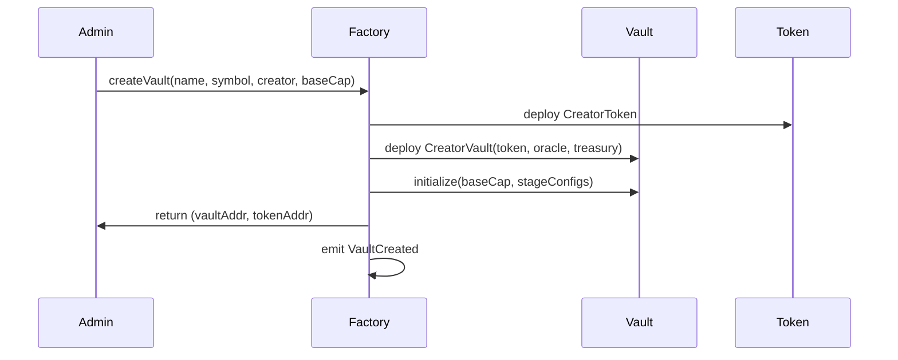
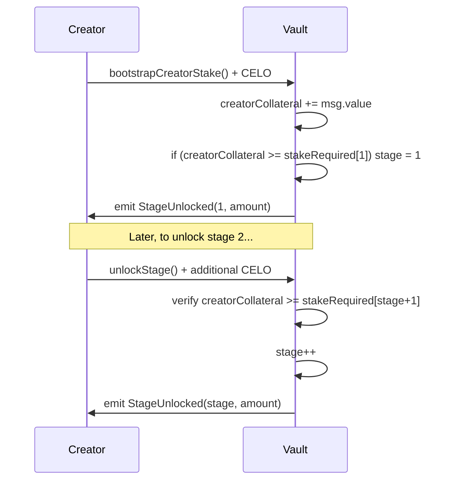
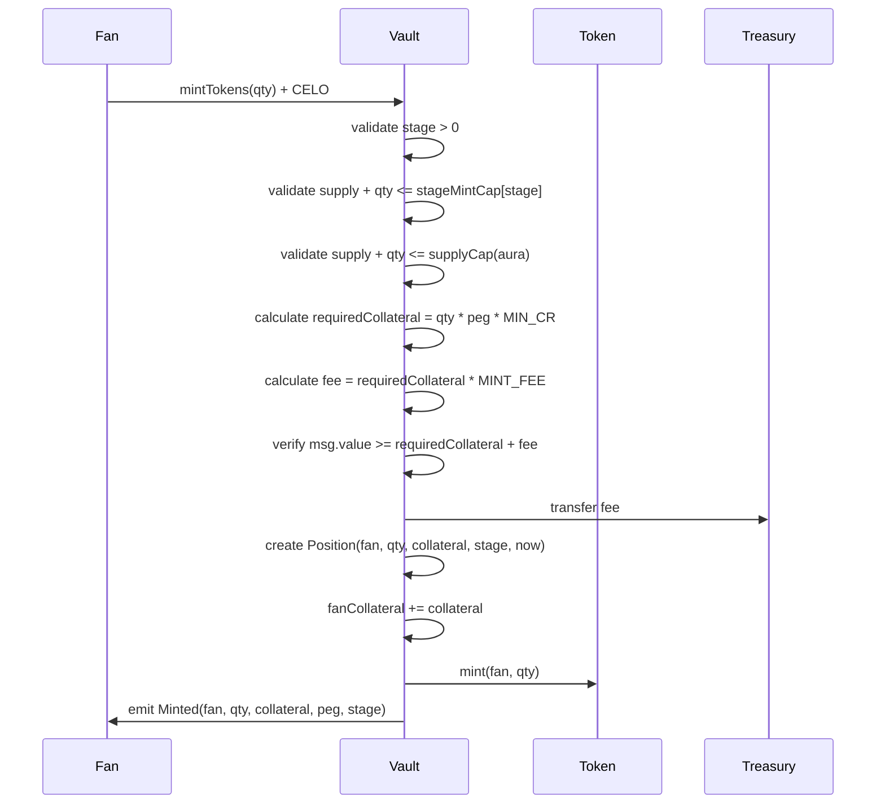
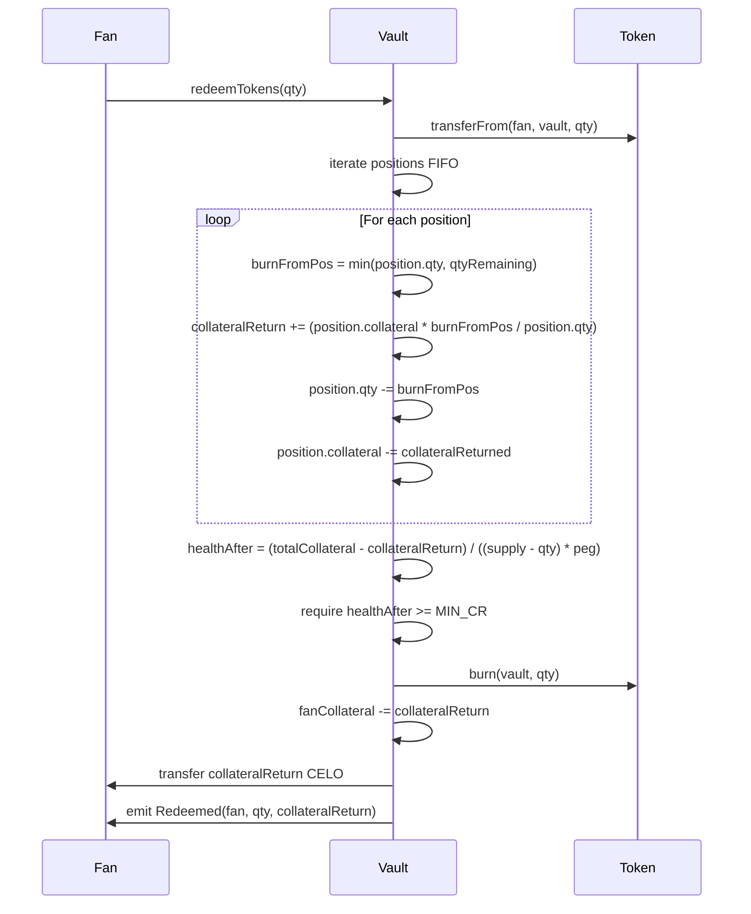
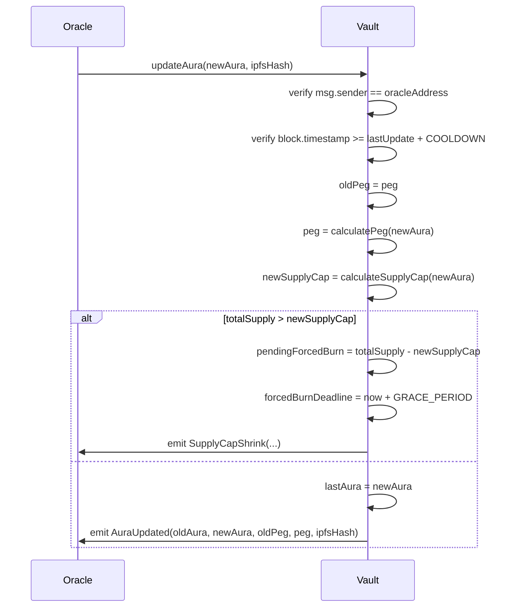
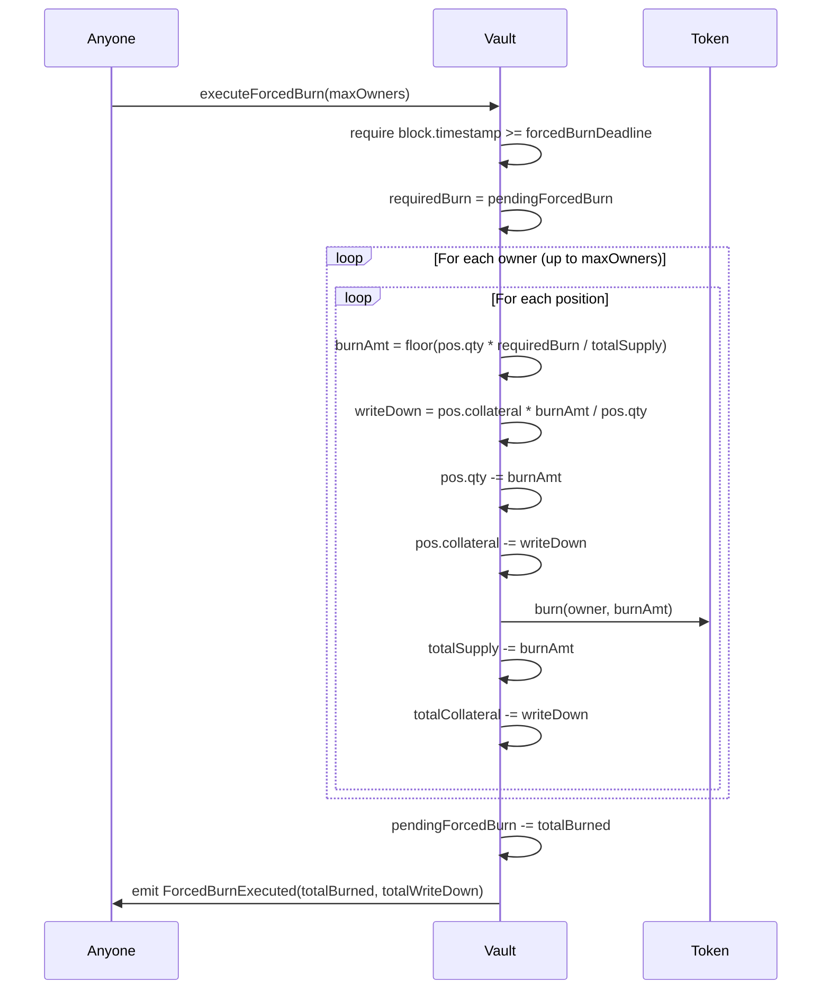
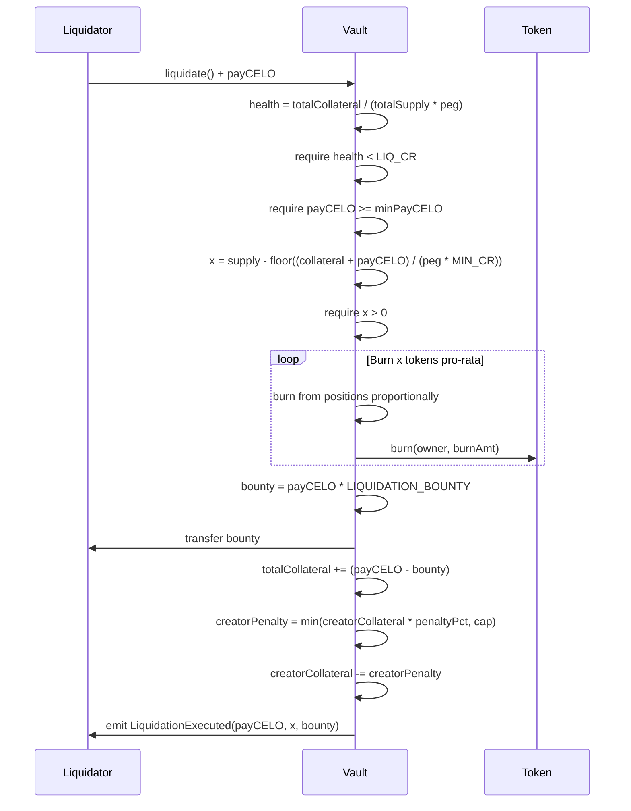

# AuraFi Creator Vaults - Design Document

## Overview

AuraFi implements a dual-collateral protocol where creators and fans jointly back creator tokens. The system uses Farcaster-derived aura scores to dynamically adjust token pegs and supply caps, creating aligned incentives through forced contraction and liquidation mechanisms.

### Core Architecture Principles

- **Dual Collateral Model**: Both creator stakes and fan deposits back the token supply
- **Aura-Anchored Economics**: Peg and supply caps derive from verifiable social metrics
- **Per-Position Accounting**: Each mint creates a traceable position for fair redemptions and burns
- **Staged Progression**: Creators unlock capacity by staking more collateral
- **Forced Alignment**: Automatic contraction and liquidation penalize both parties when health degrades

## Architecture

### System Components

```
┌─────────────────┐
│  VaultFactory   │ ──creates──> ┌──────────────┐
└─────────────────┘               │ CreatorVault │
                                  └──────────────┘
                                         │
                    ┌────────────────────┼────────────────────┐
                    │                    │                    │
              ┌─────▼──────┐      ┌─────▼──────┐      ┌─────▼──────┐
              │CreatorToken│      │ AuraOracle │      │  Treasury  │
              └────────────┘      └────────────┘      └────────────┘
```

### Contract Responsibilities

**VaultFactory**
- Deploys CreatorVault and CreatorToken pairs
- Configures stage parameters (stake requirements, mint caps)
- Maintains registry of all vaults
- Owner-controlled for governance

**CreatorVault** (Core Logic)
- Manages dual collateral (creator + fan)
- Enforces stage-gated minting
- Tracks per-position accounting
- Executes forced contraction
- Handles liquidations
- Calculates health and peg

**CreatorToken**
- Standard ERC20 with restricted mint/burn
- Only vault can mint/burn
- Represents fan ownership

**AuraOracle**
- Stores aura values per vault
- Records IPFS evidence hashes
- Enforces update cooldowns
- Access-controlled to oracle address(es)

**Treasury**
- Collects mint fees
- Owner-controlled withdrawals
- Simple accumulator

## Components and Interfaces

### Data Models

#### Position Struct
```solidity
struct Position {
    address owner;        // Fan who minted
    uint256 qty;          // Tokens minted
    uint256 collateral;   // CELO deposited (minus fees)
    uint256 stage;        // Stage at mint time
    uint256 createdAt;    // Timestamp
}
```

**Design Rationale**: Per-position tracking enables fair FIFO redemptions and proportional forced burns. Alternative approaches (global pool) would make fair attribution impossible.

#### Vault Struct
```solidity
struct Vault {
    address creator;
    address token;
    uint256 creatorCollateral;
    uint256 fanCollateral;
    uint256 totalCollateral;
    uint256 totalSupply;
    uint256 lastAura;
    uint256 peg;              // WAD (1e18 = 1 CELO per token)
    uint8 stage;
    uint256 baseCap;
    uint256 pendingForcedBurn;
    uint256 forcedBurnDeadline;
    
    mapping(address => Position[]) positions;
    address[] positionOwners;
}
```

#### Stage Configuration
```solidity
struct StageConfig {
    uint256 stakeRequired;  // Cumulative creator stake needed
    uint256 mintCap;        // Max tokens mintable at this stage
}
```

### Key Interfaces

#### VaultFactory
```solidity
function createVault(
    string calldata name,
    string calldata symbol,
    address creator,
    uint256 baseCap
) external returns (address vault, address token);

function setStageConfig(
    address vault,
    uint8 stage,
    uint256 stakeRequired,
    uint256 mintCap
) external onlyOwner;
```

#### CreatorVault
```solidity
// Creator actions
function bootstrapCreatorStake() external payable;
function unlockStage() external payable;

// Fan actions
function mintTokens(uint256 qty) external payable;
function redeemTokens(uint256 qty) external;

// Oracle/admin
function updateAura(uint256 aura, string calldata ipfsHash) external onlyOracle;

// Forced contraction & liquidation
function executeForcedBurn(uint256 maxOwnersToProcess) external;
function liquidate() external payable;

// Views
function getVaultState() external view returns (
    uint256 creatorCollateral,
    uint256 fanCollateral,
    uint256 totalCollateral,
    uint256 totalSupply,
    uint256 peg,
    uint8 stage,
    uint256 health
);

function getPosition(address owner, uint256 index) external view returns (Position memory);
```

#### AuraOracle
```solidity
function pushAura(
    address creatorVault,
    uint256 aura,
    string calldata ipfsHash
) external onlyOracle;

function getAura(address creatorVault) external view returns (uint256);
```

## Mathematical Models

### Peg Function

**Formula**: Linear interpolation with clamps
```
aN = aura / A_REF
P(aura) = BASE_PRICE * (1 + K * (aN - 1))
P = clamp(P, P_MIN, P_MAX)
```

**Parameters** (MVP defaults):
- BASE_PRICE = 1 CELO (1e18 wei)
- A_REF = 100 (baseline aura)
- K = 0.5 (sensitivity)
- P_MIN = 0.3 CELO
- P_MAX = 3.0 CELO

**Implementation**:
```solidity
function calculatePeg(uint256 aura) internal view returns (uint256) {
    // All in WAD (1e18)
    uint256 aN = (aura * WAD) / A_REF;
    int256 delta = int256(aN) - int256(WAD);
    int256 pegRaw = int256(BASE_PRICE) + (int256(K) * delta) / int256(WAD);
    
    if (pegRaw < int256(P_MIN)) return P_MIN;
    if (pegRaw > int256(P_MAX)) return P_MAX;
    return uint256(pegRaw);
}
```

### Supply Cap Function

**Formula**: Aura-scaled capacity with bounds
```
SupplyCap(aura) = BaseCap * (1 + s * (aura - A_REF) / A_REF)
SupplyCap = clamp(SupplyCap, BaseCap * 0.25, BaseCap * 4)
```

**Parameters**:
- s = 0.75 (sensitivity)
- BaseCap = per-vault parameter (e.g., 100,000 tokens)

**Design Rationale**: Supply cap grows/shrinks with aura to maintain backing ratio. Clamps prevent extreme values.

### Collateral Requirements

**Mint Requirement**:
```
requiredCollateral = qty * peg * MIN_CR
fee = requiredCollateral * MINT_FEE
totalDeposit = requiredCollateral + fee
```

**Parameters**:
- MIN_CR = 1.5 (150% collateralization)
- MINT_FEE = 0.005 (0.5%)

### Health Calculation

**Formula**:
```
Health = totalCollateral / (totalSupply * peg)
```

**Thresholds**:
- MIN_CR = 1.5 (required for minting)
- LIQ_CR = 1.2 (liquidation trigger)

**Design Rationale**: Simple ratio that accounts for current peg. Health < LIQ_CR means vault is undercollateralized and liquidatable.

## Detailed Flow Designs

### 1. Vault Creation Flow



**State Changes**:
- New Vault contract deployed with stage=0, totalSupply=0
- New Token contract deployed with vault as minter
- Factory registry updated

### 2. Creator Bootstrap & Stage Unlock Flow



**Validation**:
- Creator must deposit cumulative stake for target stage
- Stage can only increment by 1
- Aura threshold check (optional enhancement)

### 3. Fan Mint Flow



**Validation Checks**:
1. Stage > 0 (creator has bootstrapped)
2. Supply + qty ≤ stageMintCap[stage]
3. Supply + qty ≤ supplyCap(aura)
4. msg.value ≥ requiredCollateral + fee
5. HealthAfter ≥ MIN_CR

### 4. Fan Redeem Flow



**Design Rationale**: FIFO position iteration ensures fair attribution. Health check prevents redemptions that would endanger vault.

### 5. Oracle Aura Update Flow



**Key Design Decisions**:
- Cooldown prevents spam/manipulation
- IPFS hash provides audit trail
- Grace period allows fans to redeem before forced burn
- Peg updates immediately affect new mints/redeems

### 6. Forced Contraction Flow



**Gas Management**:
- Batched processing with maxOwners limit
- Multiple calls may be needed for large position sets
- Pro-rata burns ensure fairness

**Design Rationale**: Forced contraction maintains peg integrity after aura drops. Both tokens and collateral are reduced proportionally, so remaining positions maintain their collateral ratio.

### 7. Liquidation Flow



**Economic Incentives**:
- Liquidator earns 1% bounty
- Remaining payCELO improves vault health
- Creator penalty discourages negligence
- Minimum payCELO prevents griefing

## Error Handling

### Validation Errors

| Error | Condition | Recovery |
|-------|-----------|----------|
| `InsufficientCollateral` | msg.value < required | User sends more CELO |
| `StageNotUnlocked` | stage == 0 | Creator bootstraps stake |
| `ExceedsStageCap` | supply + qty > stageMintCap | Wait for stage unlock |
| `ExceedsSupplyCap` | supply + qty > supplyCap(aura) | Wait for aura increase |
| `HealthTooLow` | healthAfter < MIN_CR | Reduce mint/redeem qty |
| `NotLiquidatable` | health >= LIQ_CR | Wait for health to degrade |
| `GracePeriodActive` | now < forcedBurnDeadline | Wait for deadline |
| `Unauthorized` | msg.sender != oracle | Use correct oracle key |

### Edge Cases

**Empty Vault Redemption**:
- If totalSupply == 0, redemption reverts (no tokens to burn)
- Last redeemer gets remaining dust collateral

**Forced Burn with Single Position**:
- Pro-rata calculation still applies
- Position may be fully burned if requiredBurn >= position.qty

**Liquidation During Grace Period**:
- Liquidation can proceed even if forced burn pending
- Both mechanisms can apply simultaneously

**Oracle Stale Data**:
- Cooldown prevents too-frequent updates
- If oracle stops, vault continues with last known aura
- Emergency admin function can update oracle address

## Testing Strategy

### Unit Tests

**VaultFactory**:
- ✓ Create vault with valid parameters
- ✓ Revert on invalid baseCap
- ✓ Set stage config (owner only)
- ✓ Emit VaultCreated event

**CreatorVault - Creator Actions**:
- ✓ Bootstrap stake and unlock stage 1
- ✓ Unlock subsequent stages with additional stake
- ✓ Revert unlock without sufficient stake
- ✓ Emit StageUnlocked events

**CreatorVault - Fan Minting**:
- ✓ Mint with exact collateral requirement
- ✓ Mint with excess collateral (refund)
- ✓ Revert if stage == 0
- ✓ Revert if exceeds stage cap
- ✓ Revert if exceeds supply cap
- ✓ Revert if health would drop below MIN_CR
- ✓ Create position correctly
- ✓ Transfer fee to treasury
- ✓ Emit Minted event

**CreatorVault - Redemption**:
- ✓ Redeem full position
- ✓ Redeem partial position (FIFO)
- ✓ Redeem across multiple positions
- ✓ Revert if health would drop below MIN_CR
- ✓ Return correct collateral amount
- ✓ Emit Redeemed event

**CreatorVault - Oracle Updates**:
- ✓ Update aura with valid ipfsHash
- ✓ Revert if cooldown not elapsed
- ✓ Revert if unauthorized caller
- ✓ Calculate new peg correctly
- ✓ Trigger forced burn if supply > cap
- ✓ Emit AuraUpdated or SupplyCapShrink

**CreatorVault - Forced Contraction**:
- ✓ Execute forced burn after deadline
- ✓ Revert before deadline
- ✓ Burn tokens pro-rata across positions
- ✓ Write down collateral proportionally
- ✓ Handle batched processing (maxOwners)
- ✓ Emit ForcedBurnExecuted

**CreatorVault - Liquidation**:
- ✓ Liquidate when health < LIQ_CR
- ✓ Revert if health >= LIQ_CR
- ✓ Revert if payCELO < minimum
- ✓ Calculate tokens to burn correctly
- ✓ Pay bounty to liquidator
- ✓ Apply creator penalty
- ✓ Improve vault health
- ✓ Emit LiquidationExecuted

### Integration Tests

**Full Lifecycle**:
1. Create vault
2. Creator bootstraps and unlocks stages
3. Multiple fans mint at different stages
4. Oracle updates aura (up and down)
5. Fans redeem
6. Aura drops triggering forced burn
7. Execute forced burn
8. Health degrades, liquidation occurs

**Multi-Position Scenarios**:
- Fan creates 5 positions across different stages
- Redeem in FIFO order
- Forced burn affects all positions proportionally

**Extreme Aura Changes**:
- Aura drops from 200 to 50 (peg hits P_MIN)
- Supply cap shrinks dramatically
- Large forced burn required

**Gas Limit Testing**:
- 100 positions across 20 owners
- Forced burn requires multiple batched calls
- Verify state consistency across batches

### Security Tests

**Reentrancy**:
- Attempt reentrancy on mint, redeem, liquidate
- Verify nonReentrant modifier blocks attacks

**Access Control**:
- Non-oracle attempts updateAura (should revert)
- Non-vault attempts token mint/burn (should revert)
- Non-owner attempts factory admin functions (should revert)

**Rounding Exploits**:
- Mint/redeem tiny amounts to test rounding
- Verify no collateral can be extracted via rounding

**Front-Running**:
- Simulate oracle update front-running
- Verify cooldown prevents manipulation

## Security Considerations

### Oracle Trust Model

**MVP Approach**:
- Single oracle address (dev/CI key)
- All updates include IPFS evidence hash
- Evidence contains raw Farcaster metrics + computation

**Audit Trail**:
- Every aura update emits event with ipfsHash
- Off-chain observers can verify computation
- Dispute resolution via governance (future)

**Migration Path**:
- Replace single oracle with multisig
- Implement multi-oracle consensus (Chainlink/UMA)
- Add timelock for oracle address changes

### Economic Attack Vectors

**Sybil Aura Manipulation**:
- Off-chain aura algorithm must discount low-quality signals
- Use account age, unique reactors, diversity metrics
- Document algorithm in IPFS evidence

**Forced Burn Griefing**:
- Grace period allows fans to exit before burn
- Pro-rata burns ensure fairness
- No single party can trigger forced burn (oracle-controlled)

**Liquidation Griefing**:
- Minimum payCELO requirement (e.g., 1% of supply)
- Cooldown between liquidations per vault
- Bounty incentivizes legitimate liquidations

**Flash Loan Attacks**:
- Health checks use current state (no TWAP needed for MVP)
- Reentrancy guards on all state changes
- Mint/redeem in same transaction still subject to health checks

### Smart Contract Risks

**Rounding Errors**:
- Use WAD (1e18) throughout
- Document floor vs ceil choices
- Test boundary conditions

**Gas Limits**:
- Batched forced burn processing
- Position array growth bounded by gas costs
- No unbounded loops in critical paths

**Upgrade Path**:
- Contracts are immutable for MVP
- Factory can deploy new vault versions
- Users must migrate manually (transparent)

## Deployment Configuration

### MVP Parameters

```solidity
// Peg function
BASE_PRICE = 1e18;           // 1 CELO
A_REF = 100;
A_MIN = 0;
A_MAX = 200;
P_MIN = 0.3e18;              // 0.3 CELO
P_MAX = 3.0e18;              // 3.0 CELO
K = 0.5e18;                  // WAD

// Collateralization
MIN_CR = 1.5e18;             // 150%
LIQ_CR = 1.2e18;             // 120%
MINT_FEE = 0.005e18;         // 0.5%
LIQUIDATION_BOUNTY = 0.01e18; // 1%

// Time windows
FORCED_BURN_GRACE = 24 hours;
ORACLE_UPDATE_COOLDOWN = 6 hours;

// Per-vault defaults
baseCap = 100_000e18;        // 100k tokens
stageCount = 5;

// Stage configs (example)
stages[0] = StageConfig(0, 0);
stages[1] = StageConfig(100e18, 500e18);      // 100 CELO, 500 tokens
stages[2] = StageConfig(300e18, 2500e18);     // 300 CELO cumulative, 2500 tokens cumulative
stages[3] = StageConfig(800e18, 9500e18);     // 800 CELO, 9500 tokens
stages[4] = StageConfig(1800e18, 34500e18);   // 1800 CELO, 34500 tokens
```

### Network Deployment

**Celo Alfajores (Testnet)**:
- Deploy VaultFactory, Treasury, AuraOracle
- Set oracle address to dev key
- Create test vault for demo creator

**Celo Mainnet**:
- Deploy with multisig owner
- Use secure oracle key management
- Implement timelock for parameter changes

## Future Enhancements

**Post-MVP Features** (not in scope):
- Quest/prediction markets
- Multi-oracle consensus
- Governance token for parameter tuning
- Vault insurance fund
- Cross-vault liquidity pools
- NFT-gated stages
- Dynamic fee structures

**Optimizations**:
- Gas-optimized position storage (packed structs)
- Merkle tree for large position sets
- Layer 2 deployment for lower fees
